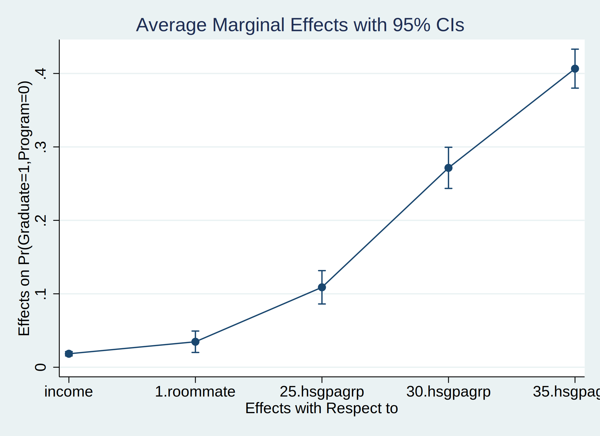

# rbicopula
## Stata module to estimate recursive bivariate copula regressions

### __Table of Contents__
1. [Model Estimation](#1-model-estimation)
2. [Conventional Postestimation Commands](#2-conventional-postestimation-commands)
3. [Treatment Effects](#3-treatment-effects)
4. [Marginal Effects](#4-marginal-effects)
5. [Examples](#5-examples)
6. [References](#6-references)
7. [About](#7-about)
8. [How to install](#8-how-to-install)
9. [Changelog](#9-changelog)

## 1. Model Estimation

`rbicopula` is a user-written command that fits a recursive bivariate copula regression using maximum likelihood estimation. It is implemented as an `lf1` ml evaluator. The model involves an outcome equation with the dependent variable _depvar_ and a treatment equation with the dependent variable _depvar_en_. Both dependent variables _depvar_ and _depvar_en_ have to be binary and coded as 0/1 variables.

`rbicopula` allows to choose from a set of different parametric bivariate distributions, so called copula functions. The bivariate residual distribution is specified to have gaussian marginals and a choice of copula functions to represent the dependence pattern between the equations' residuals. Using `copula(gaussian)` as copula type is equivalent to estimate the model by `rbiprobit`. For more information about copula functions and their properties, see Trivedi/Zimmer (2007) in the [references](#6-references}).

For `copula(frank)` the user-written command `integrate` has to be installed additionally by typing
```git
ssc install integrate, replace
```

#### Syntax

```git
rbicopula depvar [=] [indepvars] [if] [in] [weight], endogenous(depvar_en [=] [indepvars_en] [, enopts]) [options]
```

where _depvar_ is the outcome variable, _indepvars_ are the independent variables of the outcome equation, _depvar_en_ is the treatment variable, and _indepvars_en_ are the independent variables of the treatment equation. `rbicopula` automatically adds the treatment variable _depvar_en_ as an independent variable on the right-hand side of the outcome equation. Independent variables may contain factor variables and may be different or the same. All variables may contain time-series operators. `rbicopula` is limited to a recursive model with two equations and provides two tailored postestimation commands and some common Stata postestimation commands.

#### Options

    options                       Description
    -----------------------------------------------------------------------------------------------------------
    Model
      copula(copulatype)          specify copula function to control dependence pattern between equations.
                                    copulatype may be product, gaussian, fgm, plackett, clayton, frank, gumbel,
                                    joe, amh; default is copula(gaussian)
      noconstant                  suppress constant term
      offset(varname)             offset variable for outcome equation
      constraints(constraints)    apply specified linear constraints
      collinear                   keep collinear variables

    SE/Robust
      vce(vcetype)                vcetype may be oim, robust, cluster clustvar, opg, bootstrap, or jackknife

    Reporting
      level(#)                    set confidence level; default is level(95)
      lrmodel                     perform likelihood-ratio model test instead of the default Wald test
      nocnsreport                 do not display constraints
      display_options             control columns and column formats, row spacing, line width, display of
                                    omitted variables and base and empty cells, and factor-variable labeling

    Maximization
      maximize_options            control the maximization process; seldom used

      coeflegend                  display legend instead of statistics
    -----------------------------------------------------------------------------------------------------------

    enopts                        Description
    -----------------------------------------------------------------------------------------------------------
    Model
      noconstant                  suppress constant term
      offset(varname)             offset variable for treatment equation
    -----------------------------------------------------------------------------------------------------------


## 2. Conventional Postestimation Commands

As for the `biprobit`, `rbiprobit`, or `probit` commands, there are a set of common postestimation commands available for testing hypotheses, obtaining model statistics, predicting responses and saving estimation results.


    Command            Description
    -----------------------------------------------------------------------------------------------------------
      contrast         contrasts and ANOVA-style joint tests of estimates
      estat ic         Akaike's and Schwarz's Bayesian information criteria (AIC and BIC)
      estat summarize  summary statistics for the estimation sample
      estat vce        variance-covariance matrix of the estimators (VCE)
      estat (svy)      postestimation statistics for survey data
      estimates        cataloging estimation results
    * hausman          Hausman's specification test
      lincom           point estimates, standard errors, testing, and inference for linear combinations of
                         coefficients
    * lrtest           likelihood-ratio test
      nlcom            point estimates, standard errors, testing, and inference for nonlinear combinations of
                         coefficients
      predict          predictions, residuals, influence statistics, and other diagnostic measures
      predictnl        point estimates, standard errors, testing, and inference for generalized predictions
      pwcompare        pairwise comparisons of estimates
      test             Wald tests of simple and composite linear hypotheses
      testnl           Wald tests of nonlinear hypotheses
    -----------------------------------------------------------------------------------------------------------
    * hausman and lrtest are not appropriate with svy estimation results.


#### __Syntax for predict__

```git
predict [type] newvar [if] [in] [, statistic nooffset]

predict [type] {stub*|newvar_eq1 newvar_eq2 newvar_atanrho} [if] [in] , scores
```
`predict` creates a new variable containing predictions such as probabilities, linear indexes, and standard errors. The following statistics are available both in and out of sample; type `predict ... if e(sample) ...` if wanted only for the estimation sample.

        statistic          Description
        --------------------------------------------------------------------------------------------------
        Main
          p11              Pr(depvar=1, depvar_en=1); the default
          p10              Pr(depvar=1, depvar_en=0)
          p01              Pr(depvar=0, depvar_en=1)
          p00              Pr(depvar=0, depvar_en=0)
          pmarg1           Pr(depvar=1); marginal success probability for outcome equation
          pmarg2           Pr(depvar_en=1); marginal success probability for treatment equation
          pcond1           Pr(depvar=1 | depvar_en=1)
          pcond2           Pr(depvar_en=1 | depvar=1)
          xb1              linear prediction for outcome equation
          xb2              linear prediction for treatment equation
          stdp1            standard error of the linear prediction for outcome equation
          stdp2            standard error of the linear prediction for treatment equation
        --------------------------------------------------------------------------------------------------


## 3. Treatment Effects

```git
rbicopula tmeffects [if] [in] [weight] [, options]
```

`rbicopula tmeffects` estimates the average treatment effect, average treatment effect on the treated, and the average treatment effect on the conditional probability.

#### Options


    options                 Description
    -----------------------------------------------------------------------------------------------------------
    Main
      tmeffect(effecttype)  specify type of treatment effect; effecttype may be ate, atet, or atec; default is
                              ate
    SE
      vce(delta)            estimate SEs using delta method; the default
      vce(unconditional)    estimate SEs allowing for sampling of covariates

    Advanced
      noweights             ignore weights specified in estimation
      noesample             do not restrict rbicopula tmeffects to the estimation sample
      force                 estimate treatment effects despite potential problems

    Reporting
      level(#)              set confidence level; default is level(95)
      post                  post margins and their VCE as estimation results
      display_options       control columns and column formats, row spacing, line width, and factor-variable
                              labeling
    -----------------------------------------------------------------------------------------------------------
    pweights, fweights, and iweights are allowed; see weight.


#### Description of `tmeffect()`

`tmeffect(effecttype)` specifies the type of the treatment effect of the treatment variable _depvar_en_ on a specific response.

Effecttype | Description
-----------| -----------
`ate`  |  `rbicopula tmeffects` reports the __average treatment effect__, i.e. the finite difference between Pr(depvar=1) given depvar_en=1 and Pr(depvar=1) given depvar_en=0. Thus, ate is the difference between the marginal probability of outcome success given treatment success and the marginal probability of outcome success given treatment failure.
`atet`  |  `rbicopula tmeffects` reports the __average treatment effect on the treated__, i.e. the finite difference between Pr(depvar=1,depvar_en=1) given depvar_en=1 and Pr(depvar=1,depvar_en=1) given depvar_en=0, computed and averaged only for the treated observations. Thus, atet is the difference between the joint probability of outcome and treatment success conditioned on treatment success and the joint probability of outcome and treatment success conditioned on treatment failure.
`atec`  | `rbicopula tmeffects` reports the __average treatment effect on the conditional probability__, i.e. the finite difference between Pr(depvar=1\|depvar_en=1) and Pr(depvar=1\|depvar_en=0). Thus, atec is the difference between the conditional (on treatment success) probability of outcome success and the conditional (on treatment failure) probability of outcome success.


## 4. Marginal Effects

```git
rbicopula margdec [if] [in] [weight] [, response_options options]
```

Margins are statistics calculated from predictions of a previously fit model by `rbicopula` at fixed values of some covariates and averaging or otherwise integrating over the remaining covariates. The `rbicopula margdec` command estimates margins of responses for specified values of independent variables in indepvars and indepvars_en and presents the results as a table.

Capabilities include estimated marginal means, least-squares means, average and conditional marginal and partial effects (which may be reported as derivatives or as elasticities), average and conditional adjusted predictions, and predictive margins. For estimation of margins of responses for specified values of the treatment variable _depvar_en_, please use `rbicopula tmeffects`. `rbicopula margdec` won't deliver results in this case.


#### <p style="color:red;">CAUTION: Limitations of `margins` after rbicopula</p>

Do not use `margins` after you have fit your model by using `rbicopula` if your are interested in marginal means, predictive margins, marginal effects or average marginal effects. `margins` doesn't account for the recursive nature of the model and will deliver __incorrect point estimates__ and / or __incorrect standard errors__ of the point estimates.

Instead, use the postestimation commands `rbicopula margdec` and `rbicopula tmeffects` written explicitly for `rbicopula`. They cover some but not all options of `margins` and will deliver correct point estimates and standard errors.


#### Options

    response_options        Description
    -----------------------------------------------------------------------------------------------------------
    Main
      effect(effecttype)    specify type of effect for margins; effecttype may be total, direct, or indirect;
                              default is total
      predict(pred_opt)     estimate margins for predict, pred_opt
      dydx(varlist)         estimate marginal effect of variables in varlist
      eyex(varlist)         estimate elasticities of variables in varlist
      dyex(varlist)         estimate semielasticity -- d(y)/d(lnx)
      eydx(varlist)         estimate semielasticity -- d(lny)/d(x)
    -----------------------------------------------------------------------------------------------------------

    options                 Description
    -----------------------------------------------------------------------------------------------------------
    SE
      vce(delta)            estimate SEs using delta method; the default
      vce(unconditional)    estimate SEs allowing for sampling of covariates

    Advanced
      noweights             ignore weights specified in estimation
      noesample             do not restrict rbicopula margdec to the estimation sample
      force                 estimate margins despite potential problems

    Reporting
      level(#)              set confidence level; default is level(95)
      post                  post margins and their VCE as estimation results
      display_options       control columns and column formats, row spacing, line width, and factor-variable
                              labeling
    -----------------------------------------------------------------------------------------------------------

    Time-series operators are allowed if they were used in the estimation.
    pweights, fweights, and iweights are allowed; see weight.


#### Description of `effect()`

`effect(effecttype)` specifies the _effecttype_ for the margins. Once independent variables are parts of _indepvars_ and _indepvars_en_, marginal effects can be splitted into a __direct__ and an __indirect__ marginal effect.

Effecttype | Description
-----------| -----------
`effect(total)`  |  rbicopula margdec reports derivatives of the response with respect to varlist in `dydx(varlist)`, `eyex(varlist)`, `dyex(varlist)`, or `eydx(varlist)`, considering the incorporation of varlist in _indepvars_ and/or _indepvars_en_.
`effect(direct)`  |  rbicopula margdec reports derivatives of the response with respect to varlist from `dydx(varlist)`, `eyex(varlist)`, `dyex(varlist)`, or `eydx(varlist)`, considering only the incorporation of varlist in _indepvars_ and not taking into account the appearance of varlist in _indepvars_en_.
`effect(indirect)`  | rbicopula margdec reports derivatives of the response with respect to varlist from `dydx(varlist)`, `eyex(varlist)`, `dyex(varlist)`, or `eydx(varlist)`, considering only the incorporation of varlist in _indepvars_en_ and not taking into account the appearance of varlist in _indepvars_.


#### IMPORTANT:
Currently, treatment effects can only be estimated for the following copula functions:

Applicable Option | Copula Function
----------------- | ---------------
`copula(product)`  |  Product Copula
`copula(fgm)`  |  Farlie-Gumbel-Morgenstern Copula
`copula(plackett)`  |  Plackett Copula
`copula(clayton)`  |  Clayton Copula
`copula(frank)`  |  Frank Copula


## 5. Examples

#### Examples for `rbicopula`

Setup

    . webuse class10, clear
    (Class of 2010 profile)

Estimation of a __recursive bivariate copula regression__ with a __Frank copula__

    . rbicopula graduate = income i.roommate i.hsgpagrp, ///
    >         endog(program = i.campus i.scholar income i.hsgpagrp) cop(frank)

    Univariate Probits for starting values

    Fitting comparison outcome equation:

    Iteration 0:   log likelihood = -1670.5207
    Iteration 1:   log likelihood = -1174.1089
    Iteration 2:   log likelihood = -1163.4298
    Iteration 3:   log likelihood =  -1161.967
    Iteration 4:   log likelihood = -1161.8185
    Iteration 5:   log likelihood =  -1161.791
    Iteration 6:   log likelihood = -1161.7856
    Iteration 7:   log likelihood = -1161.7844
    Iteration 8:   log likelihood = -1161.7843
    Iteration 9:   log likelihood = -1161.7842

    Fitting comparison treatment equation:

    Iteration 0:   log likelihood = -1724.5355
    Iteration 1:   log likelihood = -1512.2212
    Iteration 2:   log likelihood = -1512.0846
    Iteration 3:   log likelihood = -1512.0846

    Comparison:    log likelihood = -2673.8688

    Fitting full model:

    Iteration 0:   log likelihood = -2673.8211
    Iteration 1:   log likelihood = -2669.3178
    Iteration 2:   log likelihood = -2668.6718
    Iteration 3:   log likelihood = -2668.6714
    Iteration 4:   log likelihood = -2668.6714

    Recursive Bivariate Copula Regression (Copula: FRANK)

                                                    Number of obs     =      2,500
                                                    Wald chi2(12)     =     957.97
    Log likelihood = -2668.6714                     Prob > chi2       =     0.0000

    ------------------------------------------------------------------------------
                 |      Coef.   Std. Err.      z    P>|z|     [95% Conf. Interval]
    -------------+----------------------------------------------------------------
    graduate     |
       1.program |   .3839363   .1915659     2.00   0.045      .008474    .7593987
          income |   .1451966   .0147468     9.85   0.000     .1162935    .1740997
                 |
        roommate |
            yes  |    .274152   .0593486     4.62   0.000     .1578309    .3904731
                 |
        hsgpagrp |
        2.5-2.9  |   .9466574   .1354618     6.99   0.000     .6811571    1.212158
        3.0-3.4  |   1.950385    .148173    13.16   0.000     1.659971    2.240799
        3.5-4.0  |   7.497412   1643.325     0.00   0.996     -3213.36    3228.354
                 |
           _cons |  -2.110085   .2279379    -9.26   0.000    -2.556835   -1.663335
    -------------+----------------------------------------------------------------
    program      |
          campus |
            yes  |     .74922   .0748645    10.01   0.000     .6024884    .8959517
                 |
         scholar |
            yes  |    .903145   .0580028    15.57   0.000     .7894616    1.016828
          income |  -.0787123    .009652    -8.16   0.000    -.0976299   -.0597947
                 |
        hsgpagrp |
        2.5-2.9  |   .0569215    .109988     0.52   0.605    -.1586511    .2724941
        3.0-3.4  |   .0647886   .1152315     0.56   0.574     -.161061    .2906382
        3.5-4.0  |  -.0980512   .1780694    -0.55   0.582    -.4470607    .2509584
                 |
           _cons |  -.4456948   .1279326    -3.48   0.000     -.696438   -.1949516
    -------------+----------------------------------------------------------------
          /delta |   2.222322   .7442333     2.99   0.003     .7636514    3.680993
    -------------+----------------------------------------------------------------
           theta |   2.222322   .7442333                      .7636514    3.680993
    -------------+----------------------------------------------------------------
             tau |   .2356647
    ------------------------------------------------------------------------------
    Wald test of theta=0: chi2(1) = 8.91653                   Prob > chi2 = 0.0028


Report __likelihood-ratio test__ instead of Wald test

    . rbicopula graduate = income i.roommate i.hsgpagrp, ///
    >         endog(program = i.campus i.scholar income i.hsgpagrp) cop(frank) nolog lrmodel

    Recursive Bivariate Copula Regression (Copula: FRANK)

                                                    Number of obs     =      2,500
                                                    LR chi2(11)       =    1368.07
    Log likelihood = -2668.6714                     Prob > chi2       =     0.0000

    ------------------------------------------------------------------------------
                 |      Coef.   Std. Err.      z    P>|z|     [95% Conf. Interval]
    -------------+----------------------------------------------------------------
    graduate     |
       1.program |   .3839325   .1915628     2.00   0.045     .0084764    .7593886
          income |   .1451968   .0147467     9.85   0.000     .1162938    .1740998
                 |
        roommate |
            yes  |   .2741528   .0593486     4.62   0.000     .1578317    .3904739
                 |
        hsgpagrp |
        2.5-2.9  |    .946659   .1354618     6.99   0.000     .6811587    1.212159
        3.0-3.4  |   1.950389   .1481729    13.16   0.000     1.659975    2.240803
        3.5-4.0  |   7.500715   1659.003     0.00   0.996    -3244.086    3259.087
                 |
           _cons |  -2.110086   .2279358    -9.26   0.000    -2.556832    -1.66334
    -------------+----------------------------------------------------------------
    program      |
          campus |
            yes  |   .7492212   .0748645    10.01   0.000     .6024895    .8959529
                 |
         scholar |
            yes  |   .9031463   .0580028    15.57   0.000     .7894629     1.01683
          income |  -.0787123    .009652    -8.16   0.000    -.0976299   -.0597947
                 |
        hsgpagrp |
        2.5-2.9  |   .0569211    .109988     0.52   0.605    -.1586515    .2724938
        3.0-3.4  |   .0647879   .1152315     0.56   0.574    -.1610617    .2906375
        3.5-4.0  |  -.0980515   .1780694    -0.55   0.582    -.4470611    .2509582
                 |
           _cons |  -.4456957   .1279326    -3.48   0.000    -.6964389   -.1949524
    -------------+----------------------------------------------------------------
          /delta |   2.222323   .7442206     2.99   0.003     .7636772    3.680968
    -------------+----------------------------------------------------------------
           theta |   2.222323   .7442206                      .7636772    3.680968
    -------------+----------------------------------------------------------------
             tau |   .2356648
    ------------------------------------------------------------------------------
    Wald test of theta=0: chi2(1) = 8.91684                   Prob > chi2 = 0.0028


__Prediction__ after `rbicopula`

    . predict p11, p11
    . predict p1, pmarg1
    . predict pcond1, pcond1

    . sum p11 p1 pcond1

        Variable |        Obs        Mean    Std. Dev.       Min        Max
    -------------+---------------------------------------------------------
             p11 |      2,500    .3758099     .168123   .0328388    .821138
              p1 |      2,500    .6133447    .2697109    .026443          1
          pcond1 |      2,500    .7307627     .240151   .0832402          1


#### Examples for `rbicopula margdec`

Setup

    . webuse class10, clear
    (Class of 2010 profile)

    . rbicopula graduate = income i.roommate i.hsgpagrp, ///
    >         endog(program = i.campus i.scholar income i.hsgpagrp) cop(frank)

Compute __total average marginal effects__ of _income_ on the joint probability Pr(depvar=1, depvar_en=1)

    . rbicopula margdec, dydx(income) predict(p11) effect(total)

    Average marginal effects                        Number of obs     =      2,500
    Model VCE    : OIM

    Expression   : Pr(graduate=1,program=1), predict(p11)
    dy/dx w.r.t. : income

    ------------------------------------------------------------------------------
                 |            Delta-method
                 |      dy/dx   Std. Err.      z    P>|z|     [95% Conf. Interval]
    -------------+----------------------------------------------------------------
          income |   .0032202    .002847     1.13   0.258    -.0023598    .0088002
    ------------------------------------------------------------------------------


Compute __direct average marginal effects__ of _income_ on the joint probability Pr(depvar=1, depvar_en=1)

    . rbicopula margdec, dydx(income) predict(p11) effect(direct)

    Average marginal effects                        Number of obs     =      2,500
    Model VCE    : OIM

    Expression   : Pr(graduate=1,program=1), predict(p11)
    dy/dx w.r.t. : income

    ------------------------------------------------------------------------------
                 |            Delta-method
                 |      dy/dx   Std. Err.      z    P>|z|     [95% Conf. Interval]
    -------------+----------------------------------------------------------------
          income |    .020748   .0018168    11.42   0.000     .0171871    .0243089
    ------------------------------------------------------------------------------


Compute __indirect average marginal effects__ of _income_ on the joint probability Pr(depvar=1, depvar_en=1)

    . rbicopula margdec, dydx(income) predict(p11) effect(indirect)

    Average marginal effects                        Number of obs     =      2,500
    Model VCE    : OIM

    Expression   : Pr(graduate=1,program=1), predict(p11)
    dy/dx w.r.t. : income

    ------------------------------------------------------------------------------
                 |            Delta-method
                 |      dy/dx   Std. Err.      z    P>|z|     [95% Conf. Interval]
    -------------+----------------------------------------------------------------
          income |  -.0175278   .0021575    -8.12   0.000    -.0217564   -.0132992
    ------------------------------------------------------------------------------


Compute indirect average marginal effects of __all__ independent variables on the joint probability
Pr(depvar=1, depvar_en=0) and __plot__ the results

    . rbicopula margdec, dydx(*) predict(p10) effect(direct)

    Average marginal effects                        Number of obs     =      2,500
    Model VCE    : OIM

    Expression   : Pr(graduate=1,program=0), predict(p10)
    dy/dx w.r.t. : income 1.roommate 25.hsgpagrp 30.hsgpagrp 35.hsgpagrp

    ------------------------------------------------------------------------------
                 |            Delta-method
                 |      dy/dx   Std. Err.      z    P>|z|     [95% Conf. Interval]
    -------------+----------------------------------------------------------------
          income |   .0183783   .0015127    12.15   0.000     .0154134    .0213431
                 |
        roommate |
            yes  |   .0347057   .0074373     4.67   0.000     .0201287    .0492826
                 |
        hsgpagrp |
        2.5-2.9  |   .1088569   .0115855     9.40   0.000     .0861497    .1315642
        3.0-3.4  |   .2715053   .0142936    18.99   0.000     .2434903    .2995203
        3.5-4.0  |   .4065801     .01354    30.03   0.000     .3800422     .433118
    ------------------------------------------------------------------------------
    Note: dy/dx for factor levels is the discrete change from the base level.

    . marginsplot





#### Examples for `rbicopula tmeffects`

Setup

    . webuse class10, clear
    (Class of 2010 profile)

    . rbicopula graduate = income i.roommate i.hsgpagrp, ///
    >         endog(program = i.campus i.scholar income i.hsgpagrp) cop(frank)

Compute the __average treatment effect__ of program

    . rbicopula tmeffects, tmeffect(ate)

    Treatment effect                                Number of obs     =      2,500
    Model VCE    : OIM

    Expression   : Pr(graduate=1), predict(pmarg1)
    Effect       : Average treatment effect
    dydx w.r.t.  : 1.program

    ------------------------------------------------------------------------------
                 |            Delta-method
                 |      dy/dx   Std. Err.      z    P>|z|     [95% Conf. Interval]
    -------------+----------------------------------------------------------------
             ate |   .1064717   .0511033     2.08   0.037      .006311    .2066324
    ------------------------------------------------------------------------------


Compute the __average treatment effect on the treated__ of program

    . rbicopula tmeffects, tmeffect(atet)

    Treatment effect                                Number of obs     =      1,352
    Model VCE    : OIM

    Expression   : Pr(graduate=1,program=1|program=1) - Pr(graduate=1,program=1|program=0)
    Effect       : Average treatment effect on the treated
    dydx w.r.t.  : 1.program

    ------------------------------------------------------------------------------
                 |            Delta-method
                 |      dy/dx   Std. Err.      z    P>|z|     [95% Conf. Interval]
    -------------+----------------------------------------------------------------
            atet |   .0679115   .0330877     2.05   0.040     .0030608    .1327623
    ------------------------------------------------------------------------------


Compute __average treatment effects on the conditional probability__ of program

    . rbicopula tmeffects, tmeffect(atec)

    Treatment effect                                Number of obs     =      2,500
    Model VCE    : OIM

    Expression   : Pr(graduate=1|program=1)-Pr(graduate=1|program=0), predict(pcond1)-predict(pcond10)
    Effect       : Average treatment effect on conditional probability
    dydx w.r.t.  : 1.program

    ------------------------------------------------------------------------------
                 |            Delta-method
                 |      dy/dx   Std. Err.      z    P>|z|     [95% Conf. Interval]
    -------------+----------------------------------------------------------------
            atec |   .2736936   .0164694    16.62   0.000     .2414141    .3059731
    ------------------------------------------------------------------------------


## 6. References

[Coban, M. (2020)](http://doku.iab.de/discussionpapers/2020/dp2320.pdf). Redistribution Preferences, Attitudes towards Immigrants, and Ethnic Diversity, IAB Discussion Paper 2020/23.

Greene, W.H. (2018). Econometric Analysis, 8th Edition, Pearson.

[Hasebe, T. (2013)](https://doi.org/10.1016/j.econlet.2013.08.028). Marginal effects of a bivariate binary choice model, Economic Letters 121(2), pp. 298-301.

[Trivedi, P. and Zimmer, D. (2007)](http://dx.doi.org/10.1561/0800000005). Copula Modelling: An Introduction for Practitioners, Foundations and Trends in Econmetrics} 1(1), pp. 1-111.

## 7. About

__Mustafa Coban__\
Institute for Employment Research (Germany)

email:         mustafa.coban@iab.de\
github:        [github.com/cobanomics](https://github.com/cobanomics)\
webpage:       [mustafacoban.de](https://www.mustafacoban.de)


## 8. How to Install

The latest version can be obtained via
```git
net install rbicopula, from("https://cobanomics.github.io/rbicopula/")
```

## 9. Changelog
